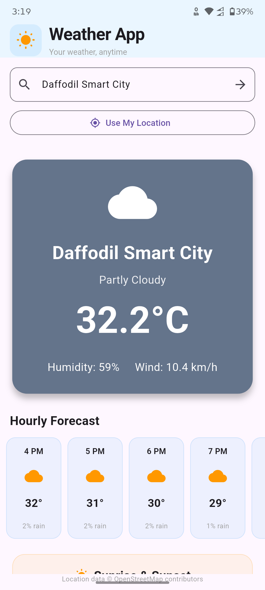
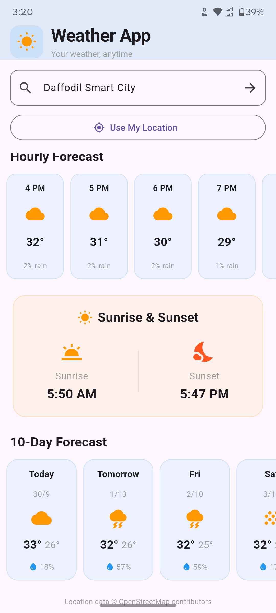
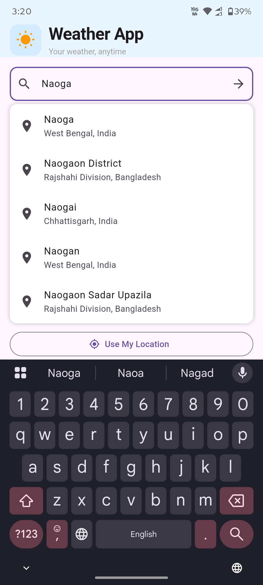

# 🌤️ Weather App

A modern and responsive weather application built with Flutter and Dart.

This application provides real-time weather information, location search, GPS-based weather, hourly forecasts, 10-day forecasts, rain probability, and sunrise & sunset information.

---

## ✨ Features

- 🔍 Search weather by city or place
- 📍 Get weather using current GPS location
- 🌎 Location search suggestions
- 🌡️ Current temperature
- 💧 Humidity information
- 💨 Wind speed
- ☀️ Dynamic weather icons
- 🌦️ Weather condition description
- 🎨 Dynamic weather-based background
- 🕐 24-hour weather forecast
- 📅 10-day weather forecast
- 🌧️ Rain probability
- 🌅 Sunrise & sunset information
- 🔄 Pull-to-refresh
- 🌙 Day and night weather support
- 📱 Responsive user interface
- 🎨 Custom 3D weather app icon

---

## 📱 Screenshots

<p align="center">
  
  
  
</p>

---

## 🛠️ Technologies Used

- Flutter
- Dart
- REST API
- HTTP
- Geolocator
- Geocoding
- Git
- GitHub

---

## 🌐 APIs

### ☁️ Weather API

This project uses the **Open-Meteo API** for weather data.

The API provides:

- Current weather
- Temperature
- Humidity
- Wind speed
- Weather conditions
- Hourly forecast
- Daily forecast
- Rain probability
- Sunrise
- Sunset

### 📍 Location Search API

The project uses the **Photon API** for location search and suggestions.

Photon uses OpenStreetMap data for geographical information.

---

## 📂 Project Structure

```text
lib/
├── main.dart
│
├── screens/
│   └── weather_home_page.dart
│
├── services/
│   ├── location_service.dart
│   ├── weather_service.dart
│   └── gps_service.dart
│
└── widgets/
    ├── search_box.dart
    ├── suggestion_list.dart
    ├── weather_card.dart
    ├── hourly_forecast.dart
    ├── daily_forecast.dart
    └── sun_info.dart
---

## 🚀 Getting Started

### 1. Clone the Repository

```bash
git clone https://github.com/moslah59/weather_app.git